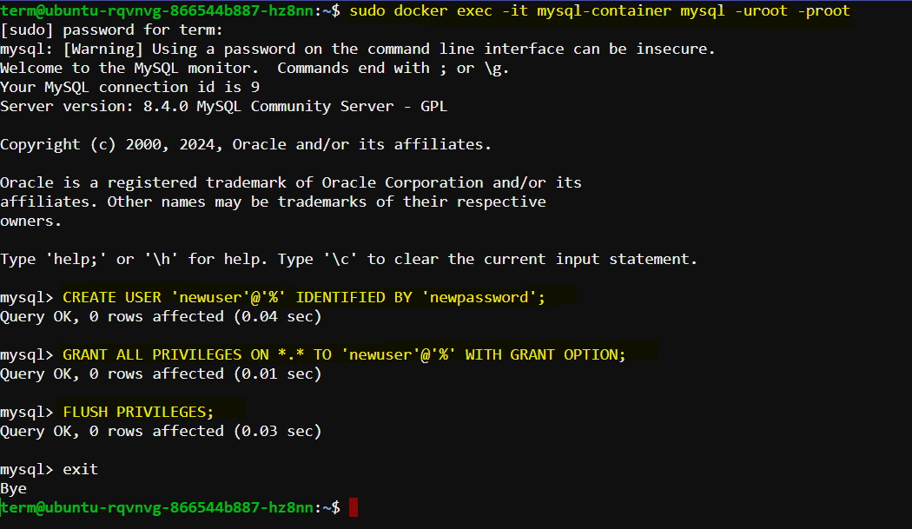
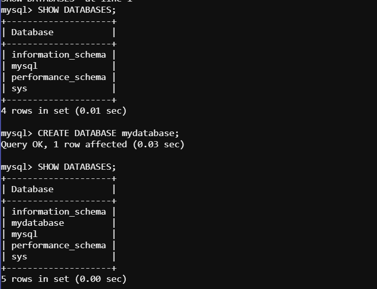
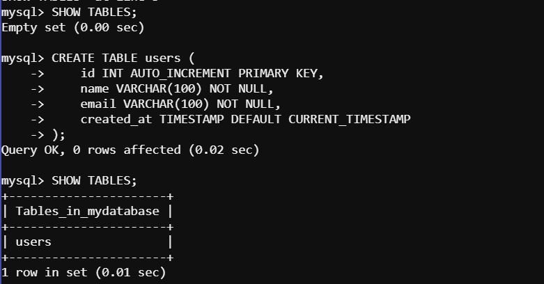

# Flask REST API with MySQL Container

This documentation demonstrates how to create a Flask REST API that connects to a MySQL database running in a Docker container using a new MySQL user.

## Steps

### 1. First Run the MySQL Container

```bash
docker run --name mysql-container -e MYSQL_ROOT_PASSWORD=root -p 3306:3306 -d mysql:latest
```

Replace `root` with your desired root password.

### 2. Access MySQL Server in Docker Container

```bash
sudo docker exec -it mysql-container mysql -u root -p root
```

This command runs the MySQL client inside the Docker container named `mysql-container`, logging in as the `root` user with the password `root`.

### 3. Create a New MySQL User

```sql
CREATE USER 'newuser'@'%' IDENTIFIED BY 'newpassword';
GRANT ALL PRIVILEGES ON *.* TO 'newuser'@'%' WITH GRANT OPTION;
FLUSH PRIVILEGES;
```


These SQL commands are executed within the MySQL client to:

1. Create a new user `newuser` with the password `newpassword`.
2. Grant all privileges on all databases and tables to `newuser` with the ability to grant those privileges to others.
3. Refresh the MySQL privilege tables to ensure the changes take effect.

### 4. Create the Flask Application

4.1 Create a virtual environment and install the necessary packages:

```bash
python3 -m venv venv
source venv/bin/activate
pip install flask mysql-connector-python
```

4.2 Create the Flask Application

Example Directory Structure

```bash
flask_app/
├── app.py
├── venv/
```

```bash
mkdir flask_app
cd flask_app
```

4.3 Example Flask rest api

```bash
from flask import Flask, jsonify, request
import mysql.connector
from mysql.connector import Error

app = Flask(__name__)

# Database connection
def get_db_connection():
    connection = None
    try:
        connection = mysql.connector.connect(
            host="localhost",
            user="newuser",
            password="newpassword",
            database="mydatabase"
        )
        if connection.is_connected():
            print("Connected to MySQL database")
    except Error as e:
        print(f"The error '{e}' occurred")
    return connection

@app.route('/')
def index():
    conn = get_db_connection()
    if conn.is_connected():
        return jsonify(message="Connected to MySQL database")
    else:
        return jsonify(message="Failed to connect to MySQL database"), 500

@app.route('/users', methods=['GET'])
def get_users():
    try:
        conn = get_db_connection()
        cursor = conn.cursor(dictionary=True)
        cursor.execute('SELECT * FROM users')
        users = cursor.fetchall()
        return jsonify(users)
    except Error as e:
        return jsonify({"error": str(e)}), 500
    finally:
        cursor.close()
        conn.close()

@app.route('/users/<int:user_id>', methods=['GET'])
def get_user(user_id):
    try:
        conn = get_db_connection()
        cursor = conn.cursor(dictionary=True)
        cursor.execute('SELECT * FROM users WHERE id = %s', (user_id,))
        user = cursor.fetchone()
        if user:
            return jsonify(user)
        else:
            return jsonify({"error": "User not found"}), 404
    except Error as e:
        return jsonify({"error": str(e)}), 500
    finally:
        cursor.close()
        conn.close()

@app.route('/users', methods=['POST'])
def add_user():
    new_user = request.get_json()
    try:
        conn = get_db_connection()
        cursor = conn.cursor()
        cursor.execute('INSERT INTO users (name, email) VALUES (%s, %s)',
                       (new_user['name'], new_user['email']))
        conn.commit()
        return jsonify({"id": cursor.lastrowid}), 201
    except Error as e:
        return jsonify({"error": str(e)}), 500
    finally:
        cursor.close()
        conn.close()

@app.route('/users/<int:user_id>', methods=['PUT'])
def update_user(user_id):
    update_user = request.get_json()
    try:
        conn = get_db_connection()
        cursor = conn.cursor()
        cursor.execute('UPDATE users SET name = %s, email = %s WHERE id = %s',
                       (update_user['name'], update_user['email'], user_id))
        conn.commit()
        if cursor.rowcount == 0:
            return jsonify({"error": "User not found"}), 404
        return jsonify({"message": "User updated successfully"})
    except Error as e:
        return jsonify({"error": str(e)}), 500
    finally:
        cursor.close()
        conn.close()

@app.route('/users/<int:user_id>', methods=['DELETE'])
def delete_user(user_id):
    try:
        conn = get_db_connection()
        cursor = conn.cursor()
        cursor.execute('DELETE FROM users WHERE id = %s', (user_id,))
        conn.commit()
        if cursor.rowcount == 0:
            return jsonify({"error": "User not found"}), 404
        return jsonify({"message": "User deleted successfully"})
    except Error as e:
        return jsonify({"error": str(e)}), 500
    finally:
        cursor.close()
        conn.close()

if __name__ == '__main__':
    app.run(debug=True)
```

4.4 **Configure and Run the Flask App**

**Set the Environment Variables for Flask**

In the terminal, set the environment variables (Linux/Mac):

```bash
export FLASK_APP=app.py
export FLASK_ENV=development
```

Run the flask application

```bash
flask run
```


Here we can see, there is no database named `mydatabase` . So we have to create a database. To do that we can use `MySQL Client`.

### 5. Install MySQL Client

```bash
sudo apt-get update
sudo apt-get install mysql-client
```

These commands update the package lists for upgrades and new package installations, then install the MySQL client tools.

### 6. Create Database named `mydatabase`

Create the  `mydatabase`  and Verify Database Creation. Grant Permissions to the New User (if not already done).

```bash
mysql -h 127.0.0.1 -u root -p root
```

```sql
CREATE DATABASE mydatabase;
GRANT ALL PRIVILEGES ON mydatabase.* TO 'newuser'@'%' WITH GRANT OPTION;
FLUSH PRIVILEGES;
```



### 7. Run the Flask Application again

```sql
flask run
```

### 8. Verify the Connection

```bash
curl http://127.0.0.1:5000
```


### 9. Create `user` table in the `mydatabase.`

To perform api endpoints we have to create a `user` table in the `mydatabase`

9.1 First we have to exec into the mysql container

```bash
sudo docker exec -it mysql-container mysql -u root -p root
```

9.2 Use the database

```bash
USE mydatabase;
```


9.3 **Create the `users` Table:**

Create the **`users`** table with the necessary columns. Here is an example SQL statement to create the table with **`id`**, **`name`**, and **`email`** columns:

```bash
CREATE TABLE users (
	id INT AUTO_INCREMENT PRIMARY KEY,
	name VARCHAR(100) NOT NULL,
	email VARCHAR(100) NOT NULL,
	created_at TIMESTAMP DEFAULT CURRENT_TIMESTAMP
);
```

9.4 **Verify Table Creation:**

Check that the table was created successfully:

```sql
SHOW TABLES;
```

9.5 **Exit MySQL:**

Exit the MySQL shell:

```sql
EXIT;
```



### 10. Perform the API endpoints

1. Get Users

```sql
curl http://localhost:5000/users
```
2. **Get User by ID**

```bash
curl http://localhost:5000/users/<user_id>
```

Replace `user_id` with the ID of the user you want to retrieve.

3. **Add a User:**

```sql
curl -X POST -H "Content-Type: application/json" -d '{"name": "John Doe", "email": "john@example.com"}' http://localhost:5000/users
```


4. To delete a user by their ID using the `DELETE` method, you can use the following **`curl`** command:

```bash
curl -X DELETE http://localhost:5000/users/<user_id>
```

Replace **`<user_id>`** with the actual ID of the user you want to delete. For example, For example, if you want to delete a user with ID **`1`**, the command would be:

```bash
curl -X DELETE http://localhost:5000/users/1
```


### Notes:

- Ensure the `newuser` and `newpassword` match the credentials you created earlier.
- Adjust `host`, `user`, `password`, and `database` in `create_connection` function according to your setup.
- The `localhost` in the Flask app code assumes that the MySQL container is running on the same host as the Flask app. If it’s running on a different host, use the appropriate IP address.

By following these steps, you will create a Flask application that connects to your MySQL container using the new user you created.